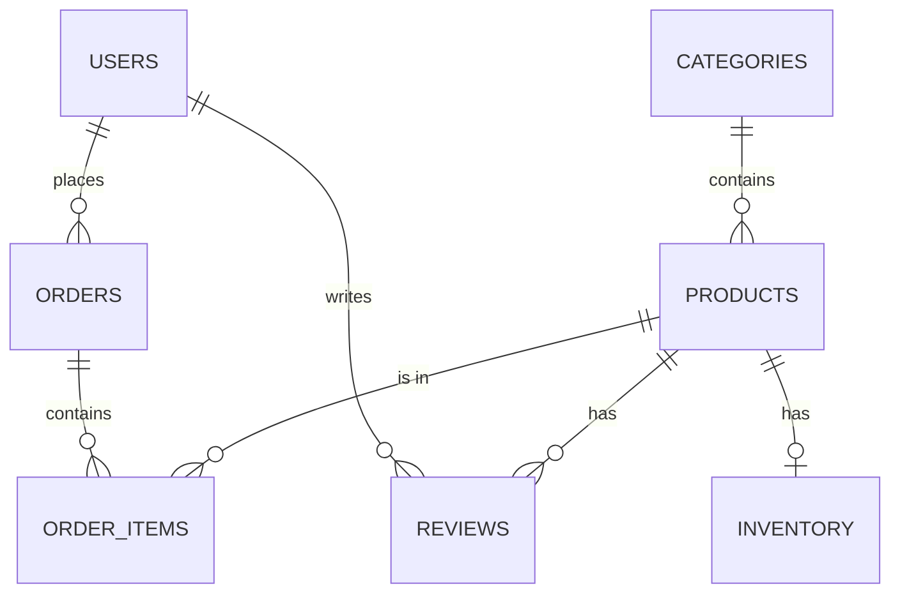

# ERD (Entity Relationship Diagram)

This repository uses the following ERD (represented in Mermaid syntax). You can paste this into a Markdown preview that supports Mermaid or convert to an image using online tools.

Notes:
- `inventory` is one-to-one with `products` (enforced by UNIQUE product_id and FK).
- `order_items` is a join table between `orders` and `products` capturing unit price and quantity.
- For a diagram image, render the Mermaid block into PNG via VSCode Mermaid preview or an online converter.
